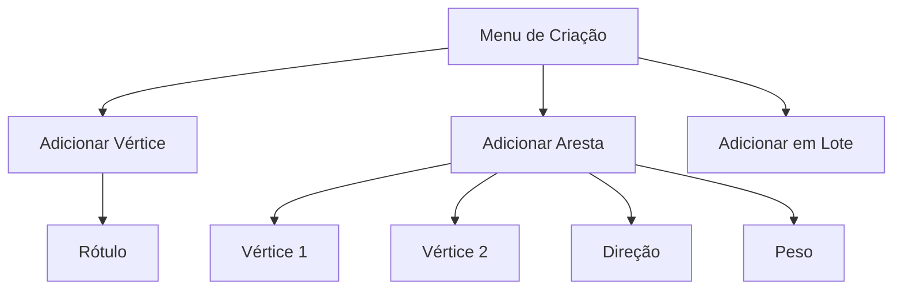
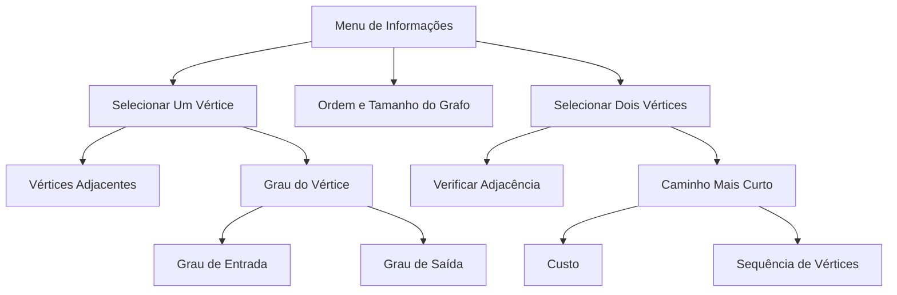

# Simulador de Grafos

Este projeto utiliza `Streamlit` para a interface e `NetworkX` para manipulação e visualização de grafos. O objetivo é criar um sistema para armazenar e manipular um Grafo Simples em memória, permitindo ao usuário criar grafos e explorar suas propriedades de maneira interativa.

O sistema possibilita a criação de grafos:
- Direcionados ou não-direcionados
- Valorados ou não-valorados
- Conexos ou não-conexos
  
E possibilita a visualização das propriedades e características do grafo, como:

- Ordem e Tamanho
- Lista de vértices adjacentes
- Grau dos vértices
- Verificação de adjacência entre vértices
- Cálculo do caminho mais curto entre dois vértices

Este projeto foi desenvolvido como parte da da disciplina `Teoria dos Grafos` da `Ciência da Computação` na `Cesar School`.

## Funcionalidades

### Menu de Criação
Este menu permite criar e configurar grafos adicionando vértices e arestas individualmente ou em lote. As opções incluem:

1. Adicionar Vértice
   - Permite inserir um vértice ao grafo, especificando um valor único para o vértice.
2. Adicionar Aresta
   - Permite inserir uma aresta entre dois vértices, especificando:
     - Vértice 1: Ponto inicial ou um dos vértices da aresta.
     - Vértice 2: Ponto final ou o outro vértice da aresta.
     - Direção: Define se a aresta é direcionada ou não.
     - Peso: Opcionalmente, define o peso da aresta.
3. Adicionar Vértices e Arestas em Lote
   - Permite inserir informações de vértices e arestas em lote, por meio de um string com definição completa do grafo.




### Menu de Informações
1. Ordem e Tamnho do Grafo
   - Exibe a Ordem (número de vértices) e o Tamanho (número de arestas) do grafo.
2. Selecionar Um Vértice
   - Permite ao usuário selecionar um vértice específico para obter mais informações:
     - Vértices Adjacentes: Lista de vértices adjacentes ao vértice selecionado. Se o grafo for direcionado, mostra a lista de adjacentes de entrada e de saída.
     - Grau do Vértice: Exibe o grau do vértice. Em grafos direcionados, mostra o grau de entrada e de saída.
3. Selecionar Dois Vértices
     - Permite ao usuário selecionar dois vértices para verificar informações sobre sua relação:
        - Verificar Adjacência: Indica se os dois vértices selecionados são adjacentes.
        - Caminho Mais Curto: Calcula e exibe o menor caminho entre os dois vértices, incluindo:
          - Custo: Custo total do menor caminho.
          - Sequência de Vértices: Caminho percorrido do primeiro vértice até o segundo.
  



## Como executar

### Pré-requisitos
- **Python**
- **Streamlit** e outras bibliotecas listadas em `requirements.txt`.

### Instruções

- Clone o repositório:
   ```bash
   git clone https://github.com/virnaamaral/graphVizProject-RelaxArestas.git
   ```
- Crie e ative o ambiente virtual:   
  
    Linux:
   ```bash
   python3 -m venv venv
   ```
   ```bash
   source venv/bin/activate
   ```
    Windows:
   ```bash
   python -m venv venv
   ```
   ```bash
   .\venv\Scripts\activate
   ```
   caso ExecutionPolicy esteja restrito:
   ```bash
   Set-ExecutionPolicy RemoteSigned -Scope CurrentUser
   ```

- Instale as dependências:
   ```bash
   pip install -r requirements.txt
   ```

 - Rode o app:
   ```bash
   streamlit run app.py
   ```

## Tabela de Atividades

| Atividade       | Caio | Diogo | Pedro | Virna | TOTAL  |
|-----------------|------|-------|-------|-------|--------|
| Especificação   | 1    | 1     | 1     | 1     | 4      |
| Codificação     | 6    | 3     | 3     | 1     | 13     |
| Testes          | 1    | 2     | 1     | 3     | 7      |
| Documentação    | 0    | 2     | 1     | 2     | 5      |
| **TOTAL**       | 8    | 8     | 6     | 7     | **29** |


## Equipe
<table>
  <td align="center">
    <a href="https://github.com/Kal-0">
      <br>
      <sub>
        <b>Caio Hirata</b>
      </sub>
    </a>
  </td>
  <td align="center">
    <a href="https://github.com/DiogoHMC">
      <br>
        <sub>
          <b>Diogo Henrique</b>
        </sub>
      </a>
  </td>
  <td align="center">
    <a href="https://github.com/pedro-coelho-dr">
      <br>
        <sub>
          <b>Pedro Coelho</b>
        </sub>
      </a>
    </td>
    <td align="center">
      <a href="https://github.com/virnaamaral">
        <br>
          <sub>
            <b>Virna Amaral</b>
          </sub>
      </a>
  </td>
</table>
<br>
